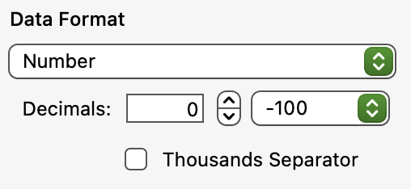
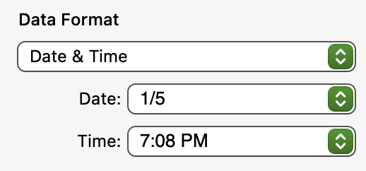

# Numbering Pushups

## Part One - A Place for Our Data

Before my shoulders started feeling like they’d fall off, I set myself on a mission: 10,000 push-ups this month. Ignoring my poor technique, I needed an effective way to track this endeavor. Enter Numbers.app with a simple spreadsheet on my MacBook.

### Step 1: Create a Table

Create a table with two columns: Amount and Time.
    
| Amount | Time       |
|--------|------------|
|        |            |

### Step 2: Populate the Ledger

Amount is the number of push-ups performed in one set.
For Time, we want the current date to be automatically pasted into our ledger whenever we enter an amount. To achieve this, create a second table with a single cell as our feeder cell. Copy the contents of this cell and use Paste Value (Cmd + Shift + V) to seal the time where we want it.

## Part Two - Calculating Our Goal

### Step 3: Create a Goal Table

Create a third table with two cells: one for our goal (10,000) and another for the remaining push-ups.
In the second cell, use the formula =A1 - SUM(Amounts) to subtract the sum of our amounts from the goal.

    
|   10,000   |
|------------|
|    9,900   |

## Part Three - Cell Formatting

### Step 4: Format Cells

Use the formatting toolbar to set the characteristics of the numbers and dates. Numbers for amounts, dates for times.

    
    

## Part Four - Table Formatting

### Step 5: Hide Unnecessary Rows

In Table 3, right-click the A Row and hide it to keep the workspace clean and focused.

## Part Five - Form Creation

### Step 6: Create a Form (iOS Required)

Use an iOS device with Numbers.app to create a form. This form will serve as our ledger, making it easier to manage entries.

## Part Six - Using Shortcuts

### Step 7: Set Up Shortcuts

Use the Shortcut that allows a record to be added to a form. Add two variables: Amount (Ask Every Time) and Time (Get Current Date). Ensure these variables are correctly applied to the Add Record function.
Part Seven - Push!

### Step 8: Execute the Plan

Do as many push-ups as you can. Run your shortcut, enter the number, hit okay, and go about your day.
